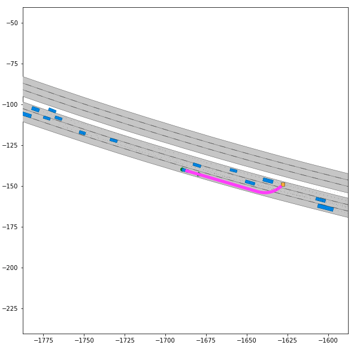

# ITAC Challenge
## Background
We use commonorad as the competition environment. The competition includes Incepio highway Hdmap and intersection map from cities.

## Conda environment
First, create a clean conda environment.
```sh
conda create --name itac python=3.7
conda activate itac
```
## Install
Install all requirements.
```sh
pip install -r requirements.txt
```

If failed at install mpi4py, do
```
sudo apt install libopenmpi-dev
conda install mpi4y
```

## Setup Environment
```sh
source setup_env.sh
```

## Scenario
You can use our scenario plot file to go through the given scenarios.
```sh
python tutorial/scenario_plot.py --input *.xml 
# for example
python tutorial/scenario_plot.py --input scenarios/highway/CHN_LC-4_1_T-1.xml
```

## Baseline Planners
Here we provide several baselilne planners to give you a hint to solve the problems in the scenarios mentioned above. Noted that they are just crude planners, they do not solve the problems very well and you don't have to develop your planner based on them. 


### Optimization based Planner
This planner is based on convex optimization and nonlinear optimization, and we use [cvxpy](https://www.cvxpy.org/) and [CasADi](https://web.casadi.org/) to construct and solve the problems. 
For more information, check out `tutorial/optimization_planner_example.ipynb` and follow the instructions.

To open our jupyter notebook tutorials, please setup environment firstly.

```sh
source start_jupyter.sh
```

Then open your web browser and enter the address

```sh
http://127.0.0.1:8888/lab
```


### Search based Planner
Search based planner is based on CommonRoad-Search module, we have intregrated SMP package into our project.

Then you can use search based planner.
```sh
python tutorial/search_planner_example.py --input *.xml  --search_method method --vehicle_model *.xml
```
Here are the explanations of the arguments:

```sh
--input *.xml           # the scenario xml file
--search_method method  # search method, ASTAR as default
                        # avaliable methods are ASTAR, GBFS, UCS, DFS, BFS
--vehicle_model *.xml   # vehicle motion primitives xml file
```

For example:
```sh
# search based planner for sedan
python tutorial/search_planner_example.py --search_method ASTAR  --vehicle_model itac/vehiclemodels/primitives/vehicle_model_primitives_V_0.0_20.0_Vstep_4.0_SA_-1.066_1.066_SAstep_0.18_T_0.5_Model_BMW_320i.xml --input scenarios/highway/CHN_LC-4_4_T-1.xml

# search based planner for semi trailer
python tutorial/search_planner_example_semi_trailer.py --search_method ASTAR  --vehicle_model itac/vehiclemodels/primitives/V_0.0_22.22_Vstep_4.44_SA_-0.55_0.55_SAstep_0.09_T_0.5_Model_SEMI_TRAILER_1.xml --input scenarios/highway/CHN_AEB-1_2_T-1.xml
```

When planner is running, it is normal that the computer doesn't seem to respond. The planner is still working on solving the planning problem. You can just wait a few minutes. Then there are two different results.

If the planner finds a solution, the trajectory will display automatically like the following image.



And a solution xml file can be found in `outputs/solutions/` folder. The file name includes vehicle model name and scenario name.

If the planner could not find a solution, it will also stop automatically. 

We also provide a juypter notebook version for you. Please check out `search_planner_example.ipynb` in `tutorial` folder.

Note that our search based planner could not find a solution in some scenarios, but this planner is just a baseline provided for you.

You can modify our planner or just write your own search based planner to find a better solution for our scenarios. To create your own search planner, you can write in `itac/SMP/motion_planner/search_algorithms/student.py` and choose `STUDENT` method in our search based planner tutorial file.


### RL Planner

**Background**

RL planner is based on reinforcement learning. We should first convert our commonroad xml maps to rl pickles format, then rl moudle will load map faster than xml format. While we have already provided AEB test scenario pickle in scenarios/highway_test_pickle filefolder.

Train an rl model by following cmd, when the training process is done, the reuslt model will be stored at outputs/logs/. Find more information at [Official tutorials](https://commonroad.in.tum.de/tutorials/vanilla-learning)

The defualt test pickle scenario is in scenarios/highway_test_pickler/, the context

```
├── meta_scenario
│   └── meta_scenario_reset_dict.pickle
├── problem_test
│   └── CHN_AEB-1_1_T-1.pickle
└── problem_train
    └── CHN_AEB-1_1_T-1.pickle
```
**Train default example**
```sh
python tutorial/rl_planner_example.py
```

**Training in a new scenario**

Convert commonroad xml foramt to pickles format. Find more information at [Official tutorials](https://commonroad.in.tum.de/tutorials/data-preprocessing)

After converting other sceanrios into pickle, you have to make sure that there is only one pickle sceario in problem_train and meta_scenario filefolder due to different lanet ids in different scenarios. Others you will get reset fault problem. Currently you can only train one sceanrio at one time while you can try your tarined model in different scenarios.

```
mkdir -p scenarios/rl_highway
cp scenarios/highway/CHN_LC-4_2_T-1.xml scenarios/rl_highway
python -m commonroad_rl.tools.pickle_scenario.xml_to_pickle \
    -i scenarios/rl_highway/ \
    -o scenarios/rl_highway_test_pickle

```

**Evaluation example**

After training process is done, then you can evalute the effect of the trained model, then find the evaluation reuslt in outputs/logs/evaluation_result/ with the following command.

```sh
rm -rf outputs/logs/evaluation_result/
python -m commonroad_rl.evaluate_model \
    --algo ppo2 \
    --test_path scenarios/highway_test_pickle/  \
    --model_path outputs/logs/ \
    --evaluation_path evaluation_result

```
**Output xml solution for RL planner**

```sh
python -m commonroad_rl.generate_solution \
    --algo ppo2 \
    --test_path scenarios/highway_test_pickle/ \
    --model_path outputs/logs/ \
    --cost_function ST \
    --solution_path evaluation_result

```